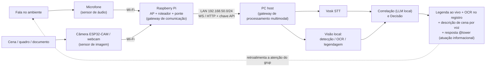

# Atividade em Grupo 01 — Análise inicial de um sistema ubíquo

**Disciplina:** Software para Sistemas Ubíquos — INF/UFG — Prof. Dr. Otávio Calaça Xavier

**Integrantes:** Thiago Nascente, Samuel Machado, Moisés Protázio, Vinícius Benevides

**Cenário escolhido:** **TowerAI** — appliance **multimodal** (áudio + visão) de colaboração, ciente de contexto e com **processamento de imagens feito localmente**, para grupos reunidos em ambientes sem conectividade externa.

## Parte 1 — Compreensão do problema

### 1. Problema e usuários
**Problema.** Grupos precisam colaborar — conversar, registrar reuniões, obter apoio de um assistente de IA, dispor de **legendas de fala em tempo real** e, adicionalmente, **extrair informação do ambiente visual** (ler quadros e documentos, estimar ocupação, descrever cenas, detectar objetos/eventos) — em locais **sem internet** ou onde a dependência da nuvem é indesejável por **privacidade, custo ou conectividade instável**. Isso é especialmente sensível no caso de imagens, que frequentemente contêm **rostos e documentos**; enviá-las à nuvem seria inaceitável em muitos contextos.

**Usuários.** (i) participantes de reuniões, aulas ou equipes de campo; (ii) pessoas com deficiência **auditiva** (legendas ao vivo) e **visual** (descrição de cenas/leitura de documentos por voz), reforçando o eixo de **acessibilidade**; (iii) um administrador que gerencia o appliance e provisiona dispositivos; (iv) dispositivos IoT sensores — microfones ESP32 e **câmeras (ESP32-CAM, webcams, câmeras de smartphones)**.

**Situação de uso.** Um ambiente físico compartilhado no qual os presentes ingressam na rede local do appliance e passam a dispor, de modo ambiente, de colaboração, transcrição e **percepção visual** do espaço, sem configuração explícita.


### 2. Contexto (informações a serem percebidas)
Três dimensões de contexto, agora **multimodais**:
- **Contexto do usuário:** identidade (login), presença (dispositivo conectado e, opcionalmente, **detecção de pessoas por visão**), papel (humano × dispositivo IoT) e sala ativa.
- **Contexto do ambiente:** dispositivos e qualidade de enlace na rede (via *Network Map*); **fala/áudio ambiente**; e o **conteúdo visual do ambiente** — pessoas presentes/ocupação, objetos, texto em quadros e documentos, condições de iluminação.
- **Contexto do sistema:** disponibilidade do modelo de linguagem e dos **modelos de visão**; integridade e **carga computacional** do host (visão é intensiva em CPU/GPU); situação de energia do gateway.

### 3. Dispositivos e comunicação
**Dispositivos.** Raspberry Pi (gateway de comunicação); PC host (servidor da aplicação, modelo de linguagem local, motor de fala *Vosk* e **motores de visão** — p.ex. detecção com Ultralytics/YOLO, OCR com Tesseract, legendagem de imagem); microfones ESP32 e **câmeras (ESP32-CAM/webcam/telefone)** como sensores; dispositivos pessoais (navegadores).

**Comunicação.** Wi-Fi 2.4 GHz provido pelo Pi (`hostapd`) sobre **LAN plana `192.168.50.0/24`**, com `dnsmasq` (DHCP/DNS) e **ponte de camada 2** (`br0 = eth0 + wlan0`). Sobre essa base: **WebSocket** para chat/legendas; **HTTP com chave de API** para ingestão de áudio (`/api/stt/transcribe`) e, de forma análoga, **de quadros/imagens** (endpoint de visão proposto, p.ex. `/api/vision/analyze`); *streaming* por WebSocket; e **mDNS** (`towerai.local`) para descoberta espontânea.

### 4. Processamento e resposta
**Local de processamento.** Todo o processamento ocorre **na borda**, no PC host: o *Vosk* transcreve o áudio; os **modelos de visão** processam as imagens (**detecção de objetos/pessoas, OCR de quadros e documentos, legendagem/descrição de cena**); o modelo de linguagem local sintetiza e correlaciona os dois canais; o servidor agrega tudo em base local (SQLite).

**Decisão/atuação produzida.** Legendas e transcrição ao vivo; **transcrição de quadros/documentos para o registro da reunião (OCR)**; **estimativa de ocupação** e **descrição de cena por voz** (acessibilidade visual); marcação/indexação de imagens; respostas do assistente **@tower**; recomendações do *Network Map*. O sistema **apenas informa e recomenda**, não executa ações físicas.


### 5. Risco principal
Com a introdução da visão, elege-se como **risco principal** a **privacidade de dados visuais**:

**Mitigações (majoritariamente por concepção).** Processamento **100% local** (as imagens não deixam o ambiente); retenção mínima (processar-e-descartar quando possível, persistindo apenas o derivado textual, p.ex. o OCR); **modo de privacidade por sala** (desabilitar captura em ambientes sensíveis); e todo acesso sob autenticação, sem endpoints de controle do host.

## Parte 2 — Modelagem do sistema

### 6. Sensores, atuadores e gateway
- **Sensores.** **Microfones** (áudio) e **câmeras** (imagem) são os sensores primários — o núcleo **multimodal** do sistema. Secundariamente, o **Network Map** atua como sensor de rede, e logins/*leases* percebem presença.
- **Atuadores.** Sendo um sistema **informacional**, a atuação recai sobre a informação e a atenção humana: legendas ao vivo, **texto extraído de quadros/documentos**, **descrições de cena por voz**, registros de reunião, respostas do assistente e alertas do Network Map. Não há atuadores físicos.
- **Gateway.** O **Raspberry Pi** é o *gateway de comunicação* (AP + roteador + DHCP/DNS + ponte); o **PC host** é o *gateway de processamento*, agora **multimodal** (STT + visão + modelo de linguagem).


### 7. Fluxo do sistema (multimodal)
```
Fenômeno físico            Sensor                Comunicação/Gateway        Processamento local         Decisão                 Resposta/Atuador
(fala)                 -> (microfone) ---------\                          /-> (Vosk: transcrição)   \
                                                >-(Wi-Fi do Pi -> LAN ----<                           >-(legendar/registrar/  -> (legenda + registro
(cena/quadro/objeto)  -> (câmera ESP32-CAM/ --/  192.168.50.0/24 ->       \-> (visão: detecção,     /   descrever/responder)     pesquisável + OCR no
                          webcam/telefone)         servidor via WS/HTTP        OCR, legendagem)                                    histórico + descrição
                                                   + chave de API)          -> (LLM correlaciona)                                  por voz + @tower)
```



### 8. Classificação
Classificações **múltiplas**, cada uma justificada:
- **Internet das Coisas (IoT):** microfones e **câmeras** ESP32, autenticados por chave de API, são objetos conectados com identidade própria publicando dados.
- **Rede de sensores (WSN):** múltiplos sensores **áudio-visuais** distribuídos alimentam um coletor central; o *Network Map* é telemetria de sensores de rede.
- **Aplicação ubíqua / ciente de contexto (multimodal):** serviço ambiente na LAN, acessível por qualquer dispositivo, que **percebe contexto auditivo e visual** e se adapta.
- **Sistema ciber-físico (em sentido informacional):** laço **percepção → processamento → resposta** ligando o mundo físico (fala, cena, topologia de rede) ao digital; a atuação é informacional, caracterizando um CPS **parcial**.

### 9. Contexto e adaptação
| Mudança de contexto | Adaptação do sistema |
|---|---|
| Host com duas interfaces (Wi-Fi de internet + LAN do Pi) e detecção incorreta | `TOWERAI_LAN_IP` fixa a interface da LAN para mDNS e Network Map *(implementado)* |
| **Baixa luminosidade / cena ruidosa (visão)** | **Reduzir taxa de quadros, aplicar pré-processamento, ou sinalizar baixa confiança da inferência** |
| **GPU indisponível ou host sob alta carga** | **Alternar para modelo de visão mais leve/CPU, reduzir resolução/FPS ou enfileirar em lote** |
| **Sala marcada como sensível (privacidade)** | **Desabilitar captura de imagem e/ou persistir apenas o derivado textual (OCR), descartando o quadro** |
| Modelo de linguagem/visão indisponível | Degradação graciosa: chat e transcrição seguem; `/health` reporta o estado |
| Novo sensor (câmera/microfone) ingressa na rede | *Rescan* do Network Map o apresenta em "+ new" e a nova fonte é incorporada |
| Subtensão/energia do Pi | Limitação de `arm_freq` e *safety-net* que reverte a configuração de rede em falha |
| Mudança de idioma do grupo | Troca do modelo de STT (`WHISPER_LANGUAGE` / modelo Vosk) e do idioma do OCR |
| Queda da internet (NAT do PC) | Por concepção, colaboração, transcrição e **visão local** permanecem funcionais offline |


## Síntese
A solução resolve o problema declarado — colaboração e **acessibilidade multimodal** em ambientes sem internet — ao **deslocar toda a computação (fala e imagem) para a borda** e ao **tornar o serviço ambiente e ciente de contexto**. As decisões estruturantes justificam-se assim: **processamento local** por *privacidade + latência + offline*; **gateway em ponte L2** por *descoberta espontânea/disponibilidade ambiente*; e **recursos acopláveis** por *extensibilidade*. A modelagem (sensores áudio-visuais, atuação informacional, dois gateways, fusão multimodal e classificação múltipla) decorre dessas decisões, e o risco principal (privacidade de dados visuais) é condizente com o escopo ampliado e mitigado pelo ambiente offline.

