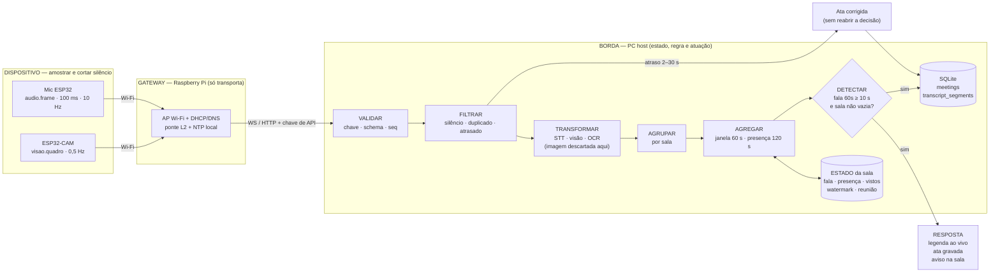
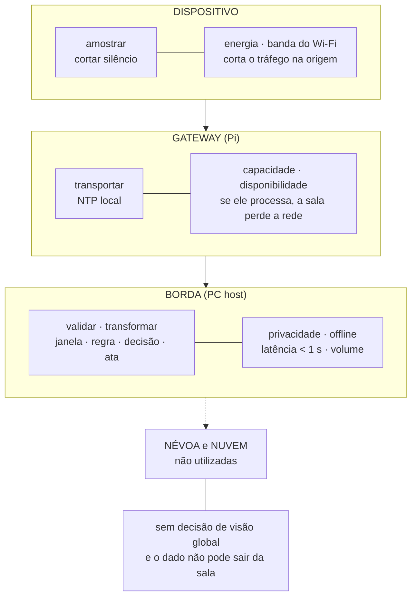

# Atividade em Grupo 02 — Processamento e distribuição de responsabilidades

**Integrantes:** Thiago Nascente, Samuel Machado, Moisés Protázio, Vinícius Benevides

**Cenário:** **TowerAI** — appliance multimodal (áudio + visão) para colaboração em salas **sem internet**. Mesmo cenário da Atividade 01.

**Decisão modelada nesta atividade:** *quando a sala entra em reunião e quando a reunião termina* — ou seja, quando ligar a legenda ao vivo e gravar a ata automaticamente, sem ninguém apertar um botão.

---

## Parte 1 — Eventos do sistema

### 1. Tipos de evento

Dois eventos de sensor alimentam a decisão:

| Evento | Ocorrência que registra | Sensor |
|---|---|---|
| `audio.frame` | um trecho de 100 ms de som foi captado na sala | microfone ESP32 |
| `visao.quadro` | uma imagem da sala foi capturada | câmera ESP32-CAM |

São ocorrências diferentes: uma é som, outra é imagem. Elas não se substituem — o som diz *se há conversa*, a imagem diz *se há gente*.

A borda transforma esses dois eventos em **dois eventos derivados**, que são os que a regra realmente usa:

| Evento derivado | Vem de | Significa |
|---|---|---|
| `fala.segmento` | `audio.frame` + STT | uma frase terminou de ser dita |
| `presenca.estimada` | `visao.quadro` + visão | quantas pessoas estão na sala |

### 2. Contrato dos eventos

**`audio.frame`**

| Item | Valor |
|---|---|
| Produtor | microfone ESP32 (`mic-esp32-01`), autenticado por chave de API |
| Entidade observada | a sala (`sala-204`) |
| Tempo do evento | instante em que o trecho começou a ser captado |
| Campos | `deviceId`, `roomId`, `eventTime`, `timeSource`, `seq`, `codec`, `rate`, `channels`, `durationMs`, `rmsDbfs`, `payloadBytes` |
| Unidades | `rate` em Hz · `durationMs` em ms · `rmsDbfs` em dBFS · `payloadBytes` em bytes |
| Identificador | `deviceId` + `seq` (sequência que só cresce, por dispositivo) |

**`visao.quadro`**

| Item | Valor |
|---|---|
| Produtor | câmera ESP32-CAM (`cam-esp32-03`), autenticada por chave de API |
| Entidade observada | a sala (`sala-204`) |
| Tempo do evento | instante da captura da imagem |
| Campos | `deviceId`, `roomId`, `eventTime`, `timeSource`, `seq`, `format`, `width`, `height`, `payloadBytes`, `lux`, `privacyMode` |
| Unidades | `width`/`height` em px · `payloadBytes` em bytes · `lux` em lux |
| Identificador | `deviceId` + `seq` |

**Nota sobre os derivados:** `fala.segmento` e `presenca.estimada` são produzidos pela **borda**, não pelo sensor. Eles **herdam o `eventTime` do evento de origem** — não recebem a hora em que foram calculados. Sem isso a janela mediria a lentidão do STT, não o que aconteceu na sala.

### 3. Exemplos

```json
{
  "type": "audio.frame",
  "deviceId": "mic-esp32-01",
  "roomId": "sala-204",
  "eventTime": "2026-08-28T19:10:35.400-03:00",
  "timeSource": "ntp-local",
  "seq": 1842,
  "codec": "pcm_s16le",
  "rate": 16000,
  "channels": 1,
  "durationMs": 100,
  "rmsDbfs": -28.4,
  "payloadBytes": 3200
}
```

```json
{
  "type": "visao.quadro",
  "deviceId": "cam-esp32-03",
  "roomId": "sala-204",
  "eventTime": "2026-08-28T19:10:36.000-03:00",
  "timeSource": "ntp-local",
  "seq": 574,
  "format": "jpeg",
  "width": 640,
  "height": 480,
  "payloadBytes": 41230,
  "lux": 180,
  "privacyMode": false
}
```

Eventos derivados na borda:

```json
{
  "type": "fala.segmento",
  "id": "seg-2f9c",
  "producer": "borda/stt",
  "sourceDevice": "mic-esp32-01",
  "roomId": "sala-204",
  "eventTime": "2026-08-28T19:10:35.400-03:00",
  "eventEndTime": "2026-08-28T19:10:38.900-03:00",
  "final": true,
  "text": "vamos revisar o cronograma da entrega",
  "confidence": 0.87
}
```

```json
{
  "type": "presenca.estimada",
  "id": "pres-77a1",
  "producer": "borda/visao",
  "sourceDevice": "cam-esp32-03",
  "roomId": "sala-204",
  "eventTime": "2026-08-28T19:10:36.000-03:00",
  "pessoas": 4,
  "confidence": 0.91
}
```

### 4. Qualidade

**Validação necessária:** todo `audio.frame` precisa ser **PCM16 mono a 16 000 Hz, com 100 ms (3 200 bytes)**.

Por quê: o motor de fala só aceita esse formato. Se a taxa estiver errada, ele não falha — ele **entrega texto sem sentido**. Uma legenda errada é pior que legenda nenhuma, porque o grupo confia nela e ela vai para a ata.

Como o sistema reconhece cada problema:

| Problema | Como reconhece | O que faz |
|---|---|---|
| **Inválido** | chave de API não confere; campo faltando; `rate ≠ 16000`; payload ≠ 3 200 bytes; `rmsDbfs` fora de −90..0; `eventTime` a mais de 5 min do relógio da borda | responde erro e conta a falha por dispositivo. 20 inválidos em 60 s → dispositivo em quarentena e aviso ao administrador |
| **Duplicado** | o par `(deviceId, seq)` já está no conjunto de vistos (guardado por 5 min) | descarta em silêncio e conta. Acontece sempre que o ESP32 reconecta e reenvia o buffer |
| **Desatualizado** | `eventTime` menor que a *watermark* − 30 s; ou `presenca.estimada` com mais de 120 s | áudio velho vai só para a ata; presença velha vira "desconhecida" e deixa de valer para a decisão |

---

## Parte 2 — Processamento temporal

### 5. Operações

```
audio.frame ──┐
              ├─► VALIDAR ─► FILTRAR ─► TRANSFORMAR ─► AGRUPAR ─► AGREGAR ─► DETECTAR ─► ATUAR
visao.quadro ─┘
```

| Operação | O que faz no TowerAI |
|---|---|
| **VALIDAR** | chave de API, campos obrigatórios, formato do áudio, `seq` não repetido |
| **FILTRAR** | descarta frame silencioso (`rmsDbfs < −45`), quadro escuro (`lux < 15`), duplicado e evento tarde demais |
| **TRANSFORMAR** | áudio → texto (STT); imagem → contagem de pessoas + OCR do quadro branco. **A imagem é apagada aqui**; só o texto derivado continua |
| **AGRUPAR** | tudo por `roomId` — cada sala tem seu próprio estado |
| **AGREGAR** | soma os segundos de fala dos últimos 60 s; guarda a presença mais recente |
| **DETECTAR** | avalia a condição "a sala está em reunião?" |
| **ATUAR** | publica a legenda ao vivo, inicia/encerra a gravação da ata, avisa a sala |

### 6. Estado e janela

**Regra: "sala em reunião".** Ela depende de eventos anteriores — um único frame de áudio nunca decide nada.

| Item | Valor |
|---|---|
| Janela de fala | **deslizante, 60 s** |
| Frequência de avaliação | a cada **5 s** |
| Validade da presença | **120 s** (depois disso, presença = desconhecida) |
| Fim da reunião | **janela de sessão**: 300 s (5 min) sem fala encerram a sessão |
| Condição para abrir | ≥ **10 s** de fala dentro dos 60 s |

**Estado mantido por sala:**

| Estado | Para quê | Expira |
|---|---|---|
| `fala[]` — lista de segmentos (início, fim) | somar os segundos de fala da janela | podado a 60 s |
| `presenca` — `{pessoas, eventTime}` | saber se a sala está vazia | vira desconhecida após 120 s |
| `vistos` — conjunto `(deviceId, seq)` | rejeitar duplicados | 5 min |
| `watermark` | saber até onde o tempo dos eventos já avançou | — |
| `ultimo_som` | medir o silêncio da sessão | — |
| `reuniao` — id da reunião ativa | não abrir duas vezes | fica no SQLite, não só na memória |

### 7. Semântica temporal

A regra usa **tempo do evento**.

**Por quê:** a decisão é sobre o estado da sala *agora*. O transporte na LAN local custa poucos milissegundos, mas o **processamento é lento e irregular** — o motor de fala trabalha em blocos de alguns segundos e só devolve a frase quando ela termina. Se a janela usasse o tempo de processamento, dois frames gravados no mesmo instante cairiam em janelas diferentes só porque um demorou mais para ser transcrito. A janela mediria a lentidão do computador, não a conversa.

**Watermark:** `maior eventTime visto − 2 s`. Interpretação: eventos até esse instante já deveriam ter chegado.

**Relógio dos sensores:** o ESP32 não tem relógio confiável. O Raspberry Pi é servidor **NTP local** (funciona offline) e os sensores se sincronizam com ele. Se a sincronia falhar, o dispositivo envia `timeSource: "ingest"` e a borda carimba a hora de chegada. É uma degradação assumida: nesse caso o tempo do evento vira, na prática, o tempo de ingestão.

### 8. Eventos atrasados

A política depende de **quanto** o evento atrasou:

| Atraso | Política | O que acontece |
|---|---|---|
| ≤ 2 s (dentro da watermark) | **ACEITAR** | entra normalmente na janela |
| 2 s a 30 s | **SEPARAR** | o texto é gravado na ata, no lugar cronológico certo, mas **não reabre** a decisão já tomada. A legenda ao vivo não é reescrita |
| > 30 s | **DESCARTAR** | registra no log de diagnóstico com o dispositivo e o atraso medido |
| `visao.quadro` com mais de 120 s | **DESCARTAR** | presença velha não pode dizer que a sala está ocupada |

**Justificativa.** Corrigir o passado é barato: a ata é um texto guardado, ninguém está olhando para ela naquele segundo. Corrigir o presente é caro: apagar e reescrever uma legenda no meio de uma reunião confunde quem depende dela para acompanhar a conversa — e esse é justamente o usuário com deficiência auditiva. Então **corrigimos o registro, nunca a legenda já exibida**.

O log de descarte não é desperdício: um dispositivo que atrasa sempre mais de 30 s é um problema de rede, e o *Network Map* usa isso como sinal.

### 9. Pseudocódigo

```
CONSTANTES
  W_FALA        = 60 s      # janela deslizante de fala
  PASSO         =  5 s      # frequência de avaliação
  MIN_FALA      = 10 s      # condição para abrir
  VALIDADE_PRES = 120 s     # depois disso a presença não vale
  GAP_SESSAO    = 300 s     # silêncio que encerra a sessão
  ATRASO_OK     =  2 s      # folga da watermark
  ATRASO_MAX    = 30 s      # além disso, descarta
  SILENCIO      = -45 dBFS

ESTADO por sala
  fala[], presenca, vistos, watermark, ultimo_som, reuniao, vazia_desde


AO RECEBER um evento e:

  # ---- VALIDAR ----
  se chave_invalida(e) ou schema_invalido(e):
      responder_erro(e); contar_invalido(e.deviceId); retornar

  # ---- FILTRAR: duplicado ----
  se (e.deviceId, e.seq) em vistos:
      contar_duplicado(e.deviceId); retornar
  vistos.adicionar((e.deviceId, e.seq))

  se e.timeSource == "ingest":
      e.eventTime = agora()          # relógio do sensor não confiável

  # ---- FILTRAR: atrasado ----
  atraso = watermark - e.eventTime
  se atraso > ATRASO_MAX:
      registrar_descarte(e, atraso); retornar
  se atraso > ATRASO_OK:
      corrigir_ata(e)                # SEPARAR: ajusta o passado, não o presente
      retornar

  watermark = max(watermark, e.eventTime - ATRASO_OK)

  # ---- TRANSFORMAR ----
  se e.tipo == "audio.frame":
      se e.rmsDbfs < SILENCIO: retornar          # silêncio não é fala
      seg = stt.alimentar(e)
      se seg.final e seg.texto != "":
          seg.eventTime = e.eventTime            # herda o tempo do sensor
          fala.anexar((seg.inicio, seg.fim))
          ultimo_som = seg.fim
          publicar_legenda(e.roomId, seg)        # ATUAR
          se reuniao != nulo: gravar_segmento(reuniao, seg)

  se e.tipo == "visao.quadro":
      se e.privacyMode ou e.lux < 15: retornar
      r = visao.analisar(e)
      presenca = { pessoas: r.pessoas, eventTime: e.eventTime }
      apagar_imagem(e)                           # só o derivado é persistido


A CADA PASSO SEGUNDOS, para cada sala:

  # ---- AGREGAR ----
  podar(fala, anterior_a: watermark - W_FALA)
  fala_60s = soma_das_duracoes(fala)

  # ---- validade dos dados ----
  presenca_fresca = (watermark - presenca.eventTime) <= VALIDADE_PRES
  sala_vazia      = presenca_fresca e presenca.pessoas == 0
  silencio        = watermark - ultimo_som

  vazia_desde = (sala_vazia ? (vazia_desde ou agora()) : nulo)

  # ---- DETECTAR + ATUAR ----
  se reuniao == nulo e fala_60s >= MIN_FALA e não sala_vazia:
      reuniao = iniciar_reuniao(sala)
      anunciar(sala, "gravando a ata")
      se não presenca_fresca:
          marcar(reuniao, "presença não verificada")

  se reuniao != nulo:
      se silencio >= GAP_SESSAO
         ou (vazia_desde e agora() - vazia_desde >= VALIDADE_PRES):
          encerrar_reuniao(reuniao)
          anunciar(sala, "ata encerrada")
          reuniao = nulo
```

**Detalhe importante da condição:** a presença **não é obrigatória** para abrir a reunião. Ela só **bloqueia** se estiver fresca e disser que há zero pessoas. Assim, quando a câmera está desligada por privacidade ou fora do ar, o sistema continua funcionando com o áudio — apenas marca a ata como "presença não verificada". A presença serve para evitar falso positivo (um vídeo tocando numa sala vazia), não para ser um pré-requisito.

---

## Parte 3 — Distribuição e resiliência

### 10. Distribuição de responsabilidades

O TowerAI usa **dois níveis: dispositivo e borda**. Não usa névoa nem nuvem.

A borda tem dois papéis distintos, em máquinas distintas:

| Responsabilidade | Local | Onde fica o estado |
|---|---|---|
| Amostrar áudio (100 ms) e imagem (0,5 Hz) | **Dispositivo** — ESP32 / ESP32-CAM | buffer curto de reenvio |
| Descartar silêncio (`rms < −45 dBFS`) | **Dispositivo** | nenhum |
| Transportar: Wi-Fi, DHCP/DNS, ponte L2, NTP local | **Gateway** — Raspberry Pi | nenhum (só encaminha) |
| Validar, deduplicar, aplicar watermark | **Borda** — PC host | conjunto `vistos`, watermark |
| STT, visão, OCR | **Borda** — PC host | modelos carregados |
| Janela de 60 s, presença, regra e decisão | **Borda** — PC host | estado por sala (memória) |
| Ata, legendas gravadas, histórico de rede | **Borda** — PC host | SQLite local |

O Raspberry Pi é **gateway**, não nó de borda: ele liga redes e encaminha mensagens, mas não guarda estado nem executa a regra. Quem decide é o PC host.

**Névoa e nuvem ficam de fora de propósito.** O sistema atende uma sala por appliance e foi projetado para funcionar sem internet. Não existe decisão que precise de visão global entre salas, então não há trabalho para a névoa. E a nuvem contradiria o risco principal declarado na Atividade 01 (privacidade de áudio e imagem). *Se* o cenário crescesse para um campus com coordenação entre salas, aí sim apareceria um nível de névoa — mas isso não existe hoje.

### 11. Justificativas

**Decisão 1 — o estado e a regra ficam na borda (PC host), não na nuvem.**

- **Privacidade:** os eventos carregam voz e imagens com rostos e documentos. Foi o risco principal eleito na Atividade 01. Manter o dado no prédio é a mitigação, não um detalhe de implementação.
- **Conectividade:** o cenário é explicitamente *sem internet*. Uma regra na nuvem simplesmente não rodaria.
- **Latência:** a legenda ao vivo precisa aparecer em menos de 1 s para acompanhar a fala. Ida e volta até a nuvem não cabe nesse orçamento.
- **Volume:** cada microfone gera ~256 kbit/s contínuos e cada câmera ~160 kbit/s. Com 4 sensores, é mais de 1,5 Mbit/s o dia inteiro — caro para transmitir e desnecessário, já que 99 % desse volume vira algumas linhas de texto.

**Decisão 2 — o filtro de silêncio roda no dispositivo, não na borda.**

- **Energia e enlace:** numa reunião típica há muito mais silêncio que fala. Cortar o silêncio no próprio ESP32 elimina a maior parte dos frames antes de entrarem no ar. O Wi-Fi 2.4 GHz da sala é compartilhado por todos os participantes — cada frame de silêncio não enviado é banda que sobra para os navegadores.
- **Limitação assumida:** o ESP32 não tem CPU para nada além de um cálculo de energia (RMS). Ele não decide, não transcreve e não conta pessoas — só decide *se vale a pena falar*. Toda a interpretação continua na borda.

**Decisão 3 — o Pi transporta, mas não processa.**

- **Capacidade e disponibilidade:** o Pi já sustenta o ponto de acesso, DHCP, DNS e a ponte L2. Colocar STT ali competiria com o encaminhamento de pacotes. Se o Pi engasga, **a sala inteira perde a rede** — não só a transcrição. Separar os papéis mantém a falha contida.

### 12. Comportamento diante de falhas

**Falha escolhida: sensor silencioso — a câmera para de enviar** (bateria, queda de Wi-Fi ou travamento).

O que acontece, em ordem:

1. Os `visao.quadro` param de chegar. Nada quebra: nenhum componente espera pela câmera.
2. Passados 120 s, a presença **expira**. O estado não fica com o último valor conhecido — ele passa a **desconhecido**. Isso é essencial: assumir "4 pessoas" para sempre seria pior que não saber.
3. A regra **degrada, mas não para**. Como `presenca_fresca` é falso, `sala_vazia` também é falso — e a condição de abertura continua valendo pelo áudio. A reunião abre e continua normalmente.
4. As atas iniciadas nesse período recebem a marca **"presença não verificada"**, para que ninguém confunda uma estimativa ausente com uma estimativa de zero.
5. O encerramento passa a depender só do silêncio de 5 min. O critério "sala vazia" fica suspenso enquanto não houver presença válida.
6. O *Network Map* percebe o dispositivo sumido na varredura seguinte (ele aparece em `removed`, comparando com a varredura anterior) e avisa o administrador — com IP, MAC e fabricante.

Nada essencial se perde: legenda ao vivo e ata continuam funcionando. O que se perde é a **confirmação** de presença, e o sistema declara isso em vez de esconder.

Outras falhas, resumidas:

| Falha | Comportamento |
|---|---|
| **Microfone cai** | sem áudio, a janela esvazia; após 5 min de silêncio a ata encerra sozinha e fica salva. Nenhuma reunião fica aberta para sempre |
| **PC host reinicia** | o estado em memória (janela, watermark, `vistos`) se perde e recomeça vazio. Mas a **decisão** está no SQLite: a reunião ativa e os segmentos já gravados sobrevivem. A ata continua de onde parou, com um intervalo visível no meio |
| **Pi reinicia** | a sala perde a rede por ~30 s. Os ESP32 reconectam e reenviam o buffer; a deduplicação por `(deviceId, seq)` impede que o mesmo trecho entre duas vezes na ata |
| **Dado desatualizado** | a regra sempre verifica a idade antes de usar a presença — nenhum valor é usado só por ser o último conhecido |

### 13. Diagrama

**Fluxo: evento → operações → estado/janela → decisão → resposta**



**Distribuição: responsabilidade → local → justificativa**



---

## Síntese

As quatro perguntas da arquitetura:

1. **Contrato** — `audio.frame` e `visao.quadro` têm produtor, entidade, tempo, campos com unidade e sequência. O que o sistema não consegue validar, ele rejeita.
2. **Tempo** — janela deslizante de 60 s sobre o **tempo do evento**, avaliada a cada 5 s, com watermark de 2 s. Presença vale por 120 s. A sessão fecha com 5 min de silêncio.
3. **Local** — dispositivo amostra e filtra; o Pi transporta; a borda mantém o estado e decide. Névoa e nuvem não são usadas porque nada no cenário as justifica.
4. **Falha** — presença que expira vira *desconhecida*, não zero. A regra continua pelo áudio e a ata declara o que não foi verificado.

O fio condutor é sempre o mesmo: **o sistema prefere admitir o que não sabe a agir sobre um dado velho.**
